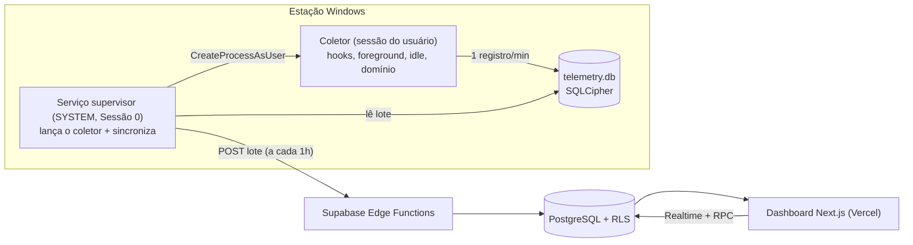

# Sistema de Telemetria e Produtividade

Monorepo de um sistema empresarial de telemetria de produtividade para estações
Windows, com foco em **baixo consumo de recursos**, **conformidade com a LGPD** e
um **painel web moderno**.

```
telemetria-produtividade/
├── agente/        Agente Windows em C# (.NET 8): serviço supervisor + coletor de sessão
├── supabase/      Schema SQL, RLS, migrations e Edge Functions (ingestão/matrícula)
├── dashboard/     Painel Next.js 15 (App Router, Tailwind, Supabase) — pronto para a Vercel
└── documentos/    Conformidade LGPD, termo de ciência e guia de instalação
```

---

## Como as peças conversam



### A decisão de arquitetura mais importante

A especificação pede hooks `WH_MOUSE_LL`/`WH_KEYBOARD_LL`, `GetForegroundWindow` e
`GetLastInputInfo` num serviço rodando como `NT AUTHORITY\SYSTEM`. **Isso não
funciona num único processo.** Desde o Windows Vista, serviços rodam na **Sessão 0**,
isolada da área de trabalho interativa:

- um hook de baixo nível instalado na Sessão 0 nunca recebe eventos do usuário;
- `GetForegroundWindow` retorna `NULL`;
- `GetLastInputInfo` reflete o ócio da Sessão 0, não o do usuário.

Por isso o agente é dividido em **dois processos**:

| Processo | Conta | Sessão | Função |
|----------|-------|--------|--------|
| **Telemetria.Servico** | SYSTEM | 0 | Windows Service. Lança o coletor em cada sessão ativa (`WTSQueryUserToken` + `CreateProcessAsUser`), sincroniza o buffer com o Supabase e cuida da matrícula. |
| **Telemetria.Coletor** | usuário logado | interativa | Instala os hooks, lê foreground/idle/domínio e grava 1 registro por minuto no buffer local. |

Os dois compartilham o mesmo `telemetry.db` (SQLCipher) em `C:\ProgramData`, com a
chave protegida por DPAPI de máquina.

---

## Privacidade desde o desenho (LGPD)

O agente coleta **apenas metadados**. Nunca registra:

- ❌ conteúdo digitado (só a **contagem** de teclas — nenhuma tecla é lida);
- ❌ capturas de tela;
- ❌ conteúdo de mensagens (apps de mensageria têm o título omitido);
- ❌ URL completa (só o **domínio**, sem caminho nem query).

Além disso: título de janela higienizado (e-mails e números longos removidos),
ícone de bandeja informando o usuário, janela de coleta configurável e termo de
ciência pronto em [`documentos/`](documentos/). Ver
[documentos/CONFORMIDADE-LGPD.md](documentos/CONFORMIDADE-LGPD.md).

---

## Passo a passo

1. **Banco** — suba o Supabase e aplique o schema: veja [supabase/README.md](supabase/README.md).
2. **Dashboard** — configure `.env.local` e rode/deploy: veja [dashboard/README.md](dashboard/README.md).
3. **Agente** — publique e instale como serviço: veja [agente/README.md](agente/README.md).

Guia unificado em [documentos/GUIA-INSTALACAO.md](documentos/GUIA-INSTALACAO.md).

---

## Stack

- **Agente:** C# / .NET 8 (Worker Service + WinForms), SQLCipher, Win32 P/Invoke, UI Automation.
- **Backend:** Supabase (PostgreSQL, RLS, Edge Functions em Deno/TypeScript, pg_cron).
- **Dashboard:** Next.js 15 (App Router, React 18), Tailwind CSS, Recharts, `@supabase/ssr`.
