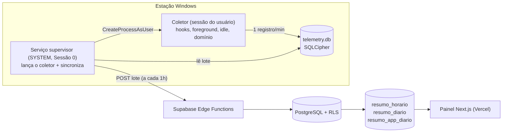

# NewSec Focus

SaaS de telemetria de produtividade para estações Windows, vendido a empresas clientes.
Agente nativo de baixo consumo, backend multiempresa e painel web com hierarquia
**empresa → equipe → pessoa**.

```
newsecfocus/
├── agente/        Agente Windows em C# (.NET 8): serviço supervisor + coletor de sessão
├── supabase/      Schema SQL, RLS, migrations, agregados e Edge Functions
├── dashboard/     Painel Next.js 15 (App Router, Tailwind, Supabase) — pronto para a Vercel
└── documentos/    Conformidade LGPD, termo de ciência e guia de instalação
```

---

## Como as peças conversam



### A decisão de arquitetura mais importante do agente

A especificação pede hooks `WH_MOUSE_LL`/`WH_KEYBOARD_LL`, `GetForegroundWindow` e
`GetLastInputInfo` num serviço rodando como `NT AUTHORITY\SYSTEM`. **Isso não funciona num
único processo.** Desde o Windows Vista, serviços rodam na **Sessão 0**, isolada da área de
trabalho interativa:

- um hook de baixo nível instalado na Sessão 0 nunca recebe eventos do usuário;
- `GetForegroundWindow` retorna `NULL`;
- `GetLastInputInfo` reflete o ócio da Sessão 0, não o do usuário.

Por isso o agente é dividido em **dois processos**:

| Processo | Conta | Sessão | Função |
|----------|-------|--------|--------|
| **Telemetria.Servico** | SYSTEM | 0 | Windows Service. Lança o coletor em cada sessão ativa (`WTSQueryUserToken` + `CreateProcessAsUser`), sincroniza o buffer com o Supabase e cuida da matrícula. |
| **Telemetria.Coletor** | usuário logado | interativa | Instala os hooks, lê foreground/idle/domínio e grava 1 registro por minuto no buffer local. |

Os dois compartilham o mesmo `telemetry.db` (SQLCipher) em `C:\ProgramData`, com a chave
protegida por DPAPI de máquina.

### A decisão de arquitetura mais importante do backend

A atividade crua tem **1 linha por minuto por estação**: 1.440 por dia, mais de 26 milhões
por ano num cliente de 50 estações. Nenhuma consulta do painel lê essa tabela. Três
agregados — por hora, por dia e por aplicativo/dia — são consolidados de forma incremental
a cada 10 minutos, com a classificação de produtividade já resolvida. É o que permite
filtrar "2026 inteiro" sem varrer a base, e o que sustenta a retenção: a atividade
minuto a minuto expira no prazo contratado, os resumos ficam para sempre.

---

## Modelo do produto

```
Plataforma (revenda)
  └── Empresa cliente         organizations   — plano, limite de estações, fuso, retenção
        └── Equipe            teams           — pertence a 1 empresa
              └── Colaborador employees       — pertence a 1 equipe
                    └── Atividade
```

Papéis de acesso: **OWNER** e **MANAGER** (empresa inteira, administram), **TEAM_LEAD**
(apenas a própria equipe, imposto pelo RLS) e **VIEWER** (leitura).

O operador da plataforma administra contas — criar empresa, plano, licenças, suspensão —
e **não tem acesso de leitura à telemetria dos clientes**. Não é convenção de tela: não
existe política de RLS que permita isso.

---

## Privacidade desde o desenho (LGPD)

O agente coleta **apenas metadados**. Nunca registra:

- ❌ conteúdo digitado (só a **contagem** de teclas — nenhuma tecla é lida);
- ❌ capturas de tela;
- ❌ conteúdo de mensagens (apps de mensageria têm o título omitido);
- ❌ URL completa (só o **domínio**, sem caminho nem query).

Além disso: título de janela higienizado (e-mails e números longos removidos), ícone de
bandeja informando o usuário, janela de coleta configurável, retenção por empresa e termo
de ciência pronto em [`documentos/`](documentos/). Ver
[documentos/CONFORMIDADE-LGPD.md](documentos/CONFORMIDADE-LGPD.md).

---

## Passo a passo

1. **Banco** — suba o Supabase e aplique as migrations: veja [supabase/README.md](supabase/README.md).
2. **Painel** — configure `.env.local` e rode/deploy: veja [dashboard/README.md](dashboard/README.md).
3. **Agente** — publique e instale como serviço: veja [agente/README.md](agente/README.md).

Guia unificado em [documentos/GUIA-INSTALACAO.md](documentos/GUIA-INSTALACAO.md).

---

## Estado de validação

| Componente | Situação |
|------------|----------|
| `supabase/` | **aplicado** num projeto real (PostgreSQL 17.6, região São Paulo): 7 migrations, 12 tabelas, 3 jobs de pg_cron ativos |
| `dashboard/` | **compila e roda** contra o banco real; `tsc --noEmit` e `next lint` limpos |
| `agente/` | **compila, publica e coleta** — o coletor gravou atividade real numa estação Windows |

Validado com 23.300 minutos de atividade sintética (5 pessoas, 3 equipes, 14 dias):

- os KPIs do painel batem **exatamente** com a contagem no dado cru (minutos ativos,
  minutos parados, teclas e número de pessoas);
- a consolidação comprimiu 23.300 linhas brutas em 393 baldes de hora e 50 de dia,
  em 4,3 segundos;
- o **isolamento por RLS funciona**: um líder de equipe enxergou 2 das 5 pessoas e
  7.001 dos 17.869 minutos, sem que nenhuma consulta precisasse saber disso.

Falta para o ciclo completo:

1. Publicar as Edge Functions (`supabase functions deploy`) — sem elas o agente não
   consegue se matricular nem sincronizar; exige um access token da conta Supabase.
2. Instalar o agente como serviço numa estação e validar matrícula e envio de lote.
3. O serviço propagar ao coletor a pausa de coleta quando a conta está suspensa; o
   servidor já devolve `collection_enabled` na resposta de ingestão.

### Instalador — decisão: sem MSI assinado

Sem certificado de assinatura de código, o MSI ficava bloqueado por SmartScreen e
antivírus de qualquer forma — então a distribuição para cliente passou a ser um
instalador guiado em `agente/instalador-cliente/`:

- **`Instalar.bat`** — clique duplo, abre um PowerShell com interface própria (moldura,
  cores, checklist de progresso), pede só o código de instalação numérico (gerado no
  painel, em Administração › Empresa) e faz o resto sozinho: copia os binários, grava a
  identidade da empresa no registro, cria e inicia o serviço Windows.
- **`Desinstalar.bat`** — remove o serviço; preserva o buffer local por padrão.
- **`publicar-cliente.bat`** — gera o pacote publicado (auto-contido, sem exigir .NET
  instalado no cliente) pronto para zipar e enviar.

O `Instalar.ps1` tenta validar o código contra o servidor antes de instalar (mostrando o
nome da empresa), mas segue mesmo se a validação falhar — a matrícula de verdade
acontece no primeiro boot do serviço, contra o banco.

Continua faltando **assinatura de código** para o SmartScreen parar de alertar; o MSI
(WiX, em `agente/instalador/`) fica como opção pronta se um certificado for adquirido
depois — hoje é caminho secundário, não o entregue ao cliente.

---

## Stack

- **Agente:** C# / .NET 8 (Worker Service + WinForms), SQLCipher, Win32 P/Invoke, UI Automation.
- **Backend:** Supabase (PostgreSQL, RLS, Edge Functions em Deno/TypeScript, pg_cron).
- **Painel:** Next.js 15 (App Router, React 18), Tailwind CSS, Recharts, `@supabase/ssr`, ExcelJS.
